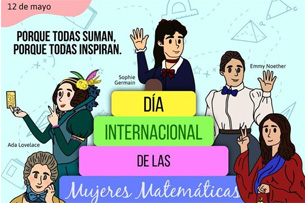
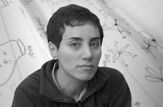
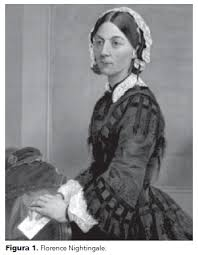
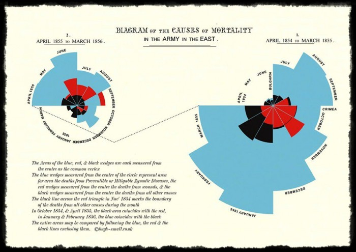
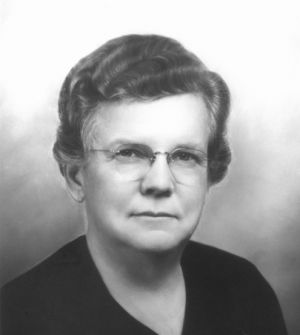

El año 2018 se estableció que el día 12 de mayo se conmemora el **Día Internacional de la Mujer en Matemáticas**, les pregunto:

::: {.callout-tip}
## Conversemos...
- ¿Saben porqué el 12 de mayo se definió como el día para la conmemoración?
- Mas relevante aún, ¿porqué creen que la comunidad internacional se puso de acuerdo para conmemorar a las mujeres en matemática?
- ¿Saben de mujeres que hayan sido destacadas en matemática, estadística u otra área de las ciencias básicas?
:::

{width=60% fig-align="center"}
---

# Día Internacional de la Mujer en Matemáticas

La fecha fue escogida en honor a **Maryam Mirzakhani** (1977--2017), matemática iraní y primera mujer en recibir la **Medalla Fields**, uno de los reconocimientos más importantes en matemáticas.

Esta conmemoración busca visibilizar las contribuciones de las mujeres en distintas áreas de las matemáticas y promover una mayor participación femenina en ciencia, tecnología, ingeniería y matemática (STEM).

::: {.callout-tip}
## Un mensaje...
Conmemorar este día no significa que las mujeres hagan una matemática diferente. Significa reconocer que, históricamente, muchas mujeres enfrentaron barreras para estudiar, investigar y ser reconocidas en matemáticas.
:::

{width=60% fig-align="center"}

[¿Quieres saber un poco más sobre Maryam Mirzakhani?](https://mujeresconciencia.com/2021/11/17/maryam-mirzakhani-la-belleza-de-los-espacios-de-moduli/)

---

# Mujeres y estadística

El reconocimiento del trabajo de Maryam Mirzakhani fue inspirador para relevar el trabajo que históricamente han desarrollado las mujeres en matemáticas y las ciencias básicas en general. Y la estadística no es la excepción: muchas mujeres han aportado al desarrollo de lo que hoy conocemos como estadística y análisis de datos, las cuales buscaron responder algunas de estas preguntas:

- ¿cómo se propaga una enfermedad?
- ¿cómo se toman decisiones usando datos?
- ¿cómo se evalúan tratamientos, políticas públicas o experimentos?
- ¿cómo distinguimos patrones reales de simples coincidencias?

La estadística y la probabilidad nos ayudan a responder este tipo de preguntas. Muchas mujeres han contribuido a desarrollar herramientas para analizar datos, diseñar experimentos, visualizar información y tomar decisiones bajo incertidumbre.

En esta primera parte conoceremos brevemente a dos de ellas: **Florence Nightingale** y **Gertrude Cox**.

---

# Florence Nightingale (1820--1910)

{width=35% fig-align="center"}

Florence Nightingale es conocida mundialmente por su trabajo en enfermería, pero también fue una pionera en **estadística** y **visualización de datos**.

Durante la Guerra de Crimea, analizó datos sobre mortalidad en hospitales militares. A partir de esos datos mostró que muchas muertes no eran causadas directamente por heridas de guerra, sino por malas condiciones sanitarias, infecciones y falta de higiene.

Una de sus contribuciones más importantes fue usar gráficos para comunicar evidencia.

{width=50% fig-align="center"}

Florence Nightingale utilizó este gráfico para mostrar que la mayoría de los soldados no morían en batalla, sino por enfermedades causadas por malas condiciones sanitarias. Gracias al análisis de datos y a la visualización de información, logró convencer a las autoridades de mejorar la higiene en los hospitales.

[Conoce más sobre Florence Nightingale](https://mujeresconciencia.com/2014/05/12/florence-nigthingale-pionera-estadistica/)

---

# Gertrude Cox (1900--1978)

{width=35% fig-align="center"}

Gertrude Cox fue una estadística estadounidense reconocida por sus contribuciones al **diseño de experimentos** y al desarrollo de la estadística moderna.

Trabajó en métodos para planificar experimentos y analizar los datos obtenidos. Su trabajo fue importante en áreas como agricultura, biología, ingeniería y educación.

Además, Gertrude Cox tuvo un rol clave en la formación de nuevas generaciones de estadísticos y estadísticos, y promovió la participación de mujeres en estadística y ciencia.

[Conoce más sobre Gertrude Cox](https://mujeresconciencia.com/2014/06/09/gertrude-cox-la-primera-dama-de-la-estadistica/ )

---

# Para finalizar esta sección...

Las historias anteriores queremos que sean una fuente de inspiración para que ustedes y muchas mujeres más sigamos aportando al desarrollo de la ciencia, valorando los espacios que se han abierto hasta ahora y, porqué no, seguir abriendo espacios para las mujeres que vienen.
