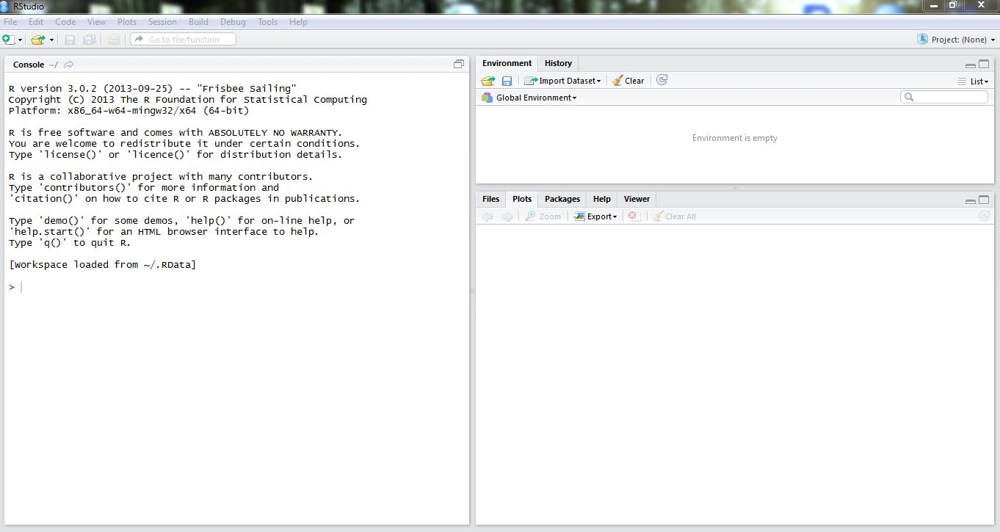
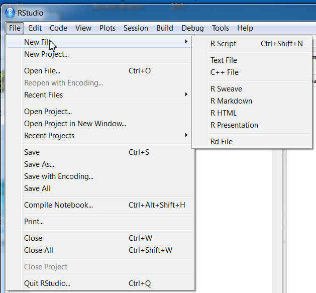
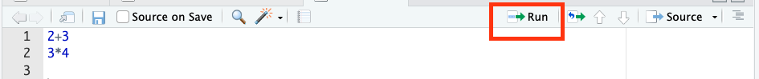

# 1. ¿Qué son R y RStudio?

**R** es un lenguaje de programación muy usado para analizar datos, hacer cálculos estadísticos, construir gráficos y simular fenómenos aleatorios.

**RStudio** es una interfaz que nos ayuda a trabajar con R de forma más cómoda.

Una forma simple de pensarlo es:

- **R** es el motor.
- **RStudio** es el panel de control.

<div style="display: grid; grid-template-columns: 1fr 1fr; gap: 40px; align-items: center; text-align: center; margin-top: 20px; margin-bottom: 20px;">

<div>

{width=180px}

**R**

Lenguaje de programación para análisis de datos, gráficos y simulaciones.

</div>

<div>

{width=180px}

**RStudio**

Entorno de trabajo para programar en R de forma más simple y organizada.

</div>

</div>

::: {.callout-tip title="Descarga e instalación"}
Por hoy, usaremos los programas que ya están instalados en los computadores. Al usar tu computador personal, ambos programas se pueden descargar desde la página oficial de Posit.

Página oficial de descarga:

[Descargar R y RStudio desde Posit](https://posit.co/download/rstudio-desktop)
:::

Dado que Rstudio es una plataforma para manejar de mejor manera con R, abriremos Rstudio para comenzar nuestro trabajo. Al abrir el programa, veremos principalmente cuatro zonas:

1. **Script**: lugar donde escribimos y guardamos nuestro código.
2. **Console**: lugar donde R ejecuta las instrucciones.
3. **Environment**: lugar donde aparecen los objetos que vamos creando.
4. **Plots**: lugar donde aparecen los gráficos.

{width=300px}

::: {.callout-tip}
## Recomendación
Durante el taller, vamos a copiar los códigos en un script y los vamos a ejecutar desde ahí. Vamos a guardar los archivos, para volverlos a ocupar durante el taller.
:::

## Crear un script en Rstudio

Para abrir un script y comenzar a escribir nuestro código, vamos a realizar los siguientes pasos:

1. Ir a la pestaña **Archivo (File)**
2. Ir a la opción **Abrir archivo (New file)**
3. Seleccionar la opción **R script**

{width=300px}

## Ejecutar código desde un script
Para ilustrar el uso del script, escribiremos en el archivo una pequeña operación matemática: escribamos en el script la operación 
```{r}
2 + 3
3*4
```
Una vez que escribimos código en el script, podemos ejecutarlo usando:

- **Ctrl + Enter** en Windows
- **Cmd + Enter** en Mac

También podemos ejecutar la línea de código presionando la tecla **Run** que aparece en la ventana superior derecha del script:

{width=300px}

::: {.callout-tip title="Importante"}
El código se escribe en el script, pero los resultados aparecen en la consola.
:::

## Guardar un script

Guardar un script nos permite conservar nuestro código para volver a utilizarlo más adelante.

Para guardar un script en RStudio:

1. Ir al menú **Archivo (File)**.
2. Seleccionar **Guardar (Save)** o **Guardar como (Save As)**
3. Elegir una carpeta en el computador. Sugerencia: guardar el archivo en el Escritorio.
4. Escribir un nombre para el archivo.
5. Guardar el archivo con extensión `.R`

Por ejemplo:

```text
bloque1.R
```

::: {.callout-tip title="Importante"}
Guardar frecuentemente el script evita perder el trabajo realizado durante la programación.
:::

## Abrir un script guardado

Si ya tenemos un script guardado en el computador, podemos volver a abrirlo para seguir trabajando. Para practicar esto, vamos a cerrar el script ya guardado y vamos a volver a abrirlo.

Para abrir un script en RStudio:

1. Ir al menú **Archivo (File)**.
2. Seleccionar **Abrir  (Open File)**
3. Buscar la carpeta donde está guardado el archivo.
4. Seleccionar el archivo guardado que tiene extensión `.R`
5. Hacer clic en **Abrir (Open)**

El script aparecerá nuevamente en el panel superior izquierdo de RStudio y podremos seguir editando o ejecutando código.

::: {.callout-tip title="Importante"}
Los archivos con extensión `.R` contienen código de programación escrito en R.
:::

# 2. Nuestras primeras instrucciones en R

Ahora iremos agregando líneas de código al archivo ya creado. Notemos que las operaciones realizadas anteriormente estaban relacionadas a números. Sin embargo, en R también podemos trabajar con texto, lo cual llamamos 'caracter':

```{r}
"Hola, estamos usando R"
```

Pero en este taller lo usaremos principalmente para explorar situaciones aleatorias. Para ello, vamos a conocer algunas funciones que nos permitirán realizar simulaciones:

#### Lancemos una moneda

Supongamos que queremos simular el lanzamiento de una moneda.

```{r}
sample(c("Cara", "Sello"), size = 1)
```

¿Les apareció el mismo resultado? ¿Porqué creen que pasa eso?

Probemos con las siguientes líneas de código...

```{r}
set.seed(260527)
sample(c("Cara", "Sello"), size = 1)
```

¿Les apareció el mismo resultado? ¿Para qué sirve la función **set.seed**?


::: {.callout-note}
## Para pensar
Ejecutemos el código varias veces...
- ¿El resultado cambia cada vez que ejecutas el código?
- ¿Puedes saber con seguridad cuál será el próximo resultado?
- ¿Qué tiene que ver esto con el azar?
:::

#### Entendamos le código...

La instrucción anterior tiene varias partes importantes.

```{r}
sample(c("Cara", "Sello"), size = 1)
```

- `sample()` permite seleccionar elementos al azar.
- `c("Cara", "Sello")` crea una colección con los posibles resultados, que en lenguaje de R se entiende como un **vector**. Para unir elementos en un vector, usamos la función **c(elemento1,elemento2,etc)** para concatenar (unir) los elementos en un solo objeto.
- `size = 1` indica que queremos seleccionar un resultado.


::: {.callout-note}
## Vocabulario básico
Una **función** en R es una instrucción que realiza una tarea. Por ejemplo, `sample()` sirve para seleccionar elementos al azar. 

Todos los **argumentos (inputs)** de las funciones van separados por coma ',' tal como se muestra en el código anterior:

- el primer argumento es `c("Cara", "Sello")`

- el segundo archumento es `size = 1`
:::

# 3. Repetir el experimento muchas veces

Ahora no lanzaremos la moneda una vez, sino 10 veces.

```{r}
sample(c("Cara", "Sello"), size = 10, replace = TRUE)
```

Como resultado obtenemos un vector de 10 elementos, con el resultado de 'lanzar la moneda'.

En el código que acabamos de usar aparece un elemento nuevo: `replace = TRUE`.

Esto significa que después de cada lanzamiento, la moneda vuelve a estar disponible. En otras palabras, cada lanzamiento puede volver a ser Cara o Sello.

::: {.callout-tip}
## Pregunta
¿Qué creen que va a pasar si usamos el argumento `replace = FALSE`?


...Veamos si su intuición es correcta...
:::

# 4. Guardar resultados en un objeto

Muchas veces queremos guardar los resultados para usarlos después. Para eso usamos un **objeto**.

```{r}
lanzamientos <- sample(c("Cara", "Sello"),
                       size = 20,
                       replace = TRUE)

lanzamientos
```

El símbolo `<-` significa “guardar en”.

En este caso, estamos guardando los 20 lanzamientos en un objeto llamado `lanzamientos`.

::: {.callout-note}
## Idea clave
Un objeto es como una caja con nombre en la memoria temporal de la sesión de R. Guardamos información en esa caja para usarla más adelante.
:::

# 5. Contar resultados con `table()`

Ahora podemos contar cuántas caras y cuántos sellos y cuántas caras aparecieron en los 20 lanzamientos.

```{r}
table(lanzamientos)
```

Probemos con más lanzamientos...

```{r}
lanzamientos <- sample(c("Cara", "Sello"),
                       size = 100,
                       replace = TRUE)

table(lanzamientos)
```

::: {.callout-note}
## Para discutir

- ¿Deberían aparecer exactamente 50 caras y 50 sellos?
- Si no ocurre, ¿significa que la moneda está cargada?
- ¿Qué creen que ocurrirá si hacemos 1000 lanzamientos?
:::

# 6. Gráficos para resumir la información

Los gráficos nos ayudan a ver los resultados de manera más clara.

```{r}
barplot(table(lanzamientos))
```

Podemos hacer que este gráfico se vea más bonito, agregando algunos inputs:

- **main:** título del gráfico
- **xlab**: nombre eje X
- **ylab**: nombre eje Y
- **col**: colores a las barras. Una paleta de colores de R se puede encontrar en [este link](https://derekogle.com/NCGraphing/resources/colors).

```{r}
barplot(table(lanzamientos),
        main = "Resultados de 100 lanzamientos",
        xlab = "Resultado",
        ylab = "Frecuencia",
        col = "purple")
```


También podemos mirar frecuencias relativas, es decir, proporciones. Para ello, cada una de las frecuencias anteriores debemos dividirlas por la cantidad de lanzamientos que tenemos. Este íltimo valor lo podemos obtener de diferentes maneras. Una de ellas es usar la función **length** con la cual obtenemos el largo de un vector.

```{r}
frecuencias_relativas <- table(lanzamientos) / length(lanzamientos)

frecuencias_relativas
```

Podemos también hacer el gráfico de barras de las proporciones al igual que antes, sin embargo tenemos que tener presente que las proporciones son siempre valores en el intervalo $[0,1]$, por lo que agregaremos esa información a la línea de código, con el comando **ylim** como se muestra a continuación:

```{r}
barplot(frecuencias_relativas,
        main = "Frecuencias relativas de 100 lanzamientos",
        xlab = "Resultado",
        ylab = "Frecuencia relativa",
        col = "purple",
        ylim = c(0, 1))
```

# 7. ¿Cuál es la probabilidad de observar una cara al lanzar una moneda?

## ¿Cuál es la probabilidad de obtener cara?

Ya vimos que podemos calcular la proporción de caras usando:

```{r}
mean(lanzamientos == "Cara")
```

Pero ahora aparece una pregunta importante:

::: {.callout-tip}
## Para conversar

Si lanzamos una moneda muchas veces, ¿cómo podríamos aproximar la probabilidad de obtener cara?

- ¿Bastará con un solo lanzamiento?
- ¿Qué ocurrirá si hacemos más lanzamientos?
- ¿La proporción cambiará mucho o poco?
:::

Una idea natural es repetir el experimento muchas veces y observar cómo cambia la proporción de caras.

Comenzaremos haciendo el proceso paso a paso.

En R, una comparación como esta produce valores `TRUE` o `FALSE`.

```{r}
lanzamientos == "Cara"
```

R interpreta `TRUE` como 1 y `FALSE` como 0 cuando calculamos un promedio. Por eso, podemos usar `mean()` para calcular proporciones.

```{r}
mean(lanzamientos == "Cara")
```

Esto calcula la proporción de lanzamientos que fueron Cara.

## ¿Qué ocurre cuando aumentamos el número de lanzamientos?

Primero haremos el proceso paso a paso.

### Un lanzamiento

```{r}
lanzamientos_1 <- sample(c("Cara", "Sello"),
                         size = 1,
                         replace = TRUE)

lanzamientos_1

mean(lanzamientos_1 == "Cara")
```

La proporción de caras puede ser 0 o 1, porque solo hicimos un lanzamiento.

---

### Dos lanzamientos

```{r}
lanzamientos_2 <- sample(c("Cara", "Sello"),
                         size = 2,
                         replace = TRUE)

lanzamientos_2

mean(lanzamientos_2 == "Cara")
```

Ahora la proporción puede ser 0, 0.5 o 1.

---

### Cinco lanzamientos

```{r}
lanzamientos_5 <- sample(c("Cara", "Sello"),
                         size = 5,
                         replace = TRUE)

lanzamientos_5

mean(lanzamientos_5 == "Cara")
```

---

### Diez lanzamientos

```{r}
lanzamientos_10 <- sample(c("Cara", "Sello"),
                          size = 10,
                          replace = TRUE)

lanzamientos_10

mean(lanzamientos_10 == "Cara")
```

---

### Cincuenta lanzamientos

```{r}
lanzamientos_50 <- sample(c("Cara", "Sello"),
                          size = 50,
                          replace = TRUE)

mean(lanzamientos_50 == "Cara")
```

::: {.callout-tip}
## Para conversar

¿Qué cambia cuando pasamos de 1 lanzamiento a 50 lanzamientos?

¿La proporción de caras se vuelve más estable?
:::

---

## Estamos repitiendo una idea

En todos los ejemplos hicimos casi lo mismo:

1. simulamos una cierta cantidad de lanzamientos;
2. contamos cuántas veces salió "Cara";
3. calculamos la proporción de caras.

Lo único que cambia es el número de lanzamientos.

Cuando en programación repetimos muchas veces una misma idea, podemos crear una **función**.

---

## Crear una función para simular lanzamientos

La siguiente función recibe un número `n`.

Ese número representa cuántos lanzamientos queremos simular.

```{r}
proporcion_caras <- function(n) {
  
  lanzamientos <- sample(c("Cara", "Sello"),
                         size = n,
                         replace = TRUE)
  
  proporcion <- mean(lanzamientos == "Cara")
  
  return(proporcion)
}
```

Ahora podemos usar la función con distintas cantidades de lanzamientos:

```{r}
proporcion_caras(1)
proporcion_caras(2)
proporcion_caras(5)
proporcion_caras(10)
proporcion_caras(50)
proporcion_caras(100)
```

::: {.callout-note}
## Idea importante

Una función nos permite guardar un procedimiento para reutilizarlo muchas veces sin escribir todo el código nuevamente.
:::

---

## Guardar muchas proporciones

Ahora queremos repetir el experimento para:

- 1 lanzamiento;
- 2 lanzamientos;
- 3 lanzamientos;
- ...
- 1000 lanzamientos.

Para eso crearemos un vector vacío donde guardaremos los resultados.

```{r}
n_max <- 1000

proporciones <- numeric(n_max)
```

Ahora usamos un ciclo `for`.

```{r}
for (n in 1:n_max) {
  proporciones[n] <- proporcion_caras(n)
}
```

¿Qué hace este ciclo?

- cuando `n = 1`, calcula la proporción de caras con 1 lanzamiento;
- cuando `n = 2`, calcula la proporción de caras con 2 lanzamientos;
- cuando `n = 3`, calcula la proporción de caras con 3 lanzamientos;
- y así sucesivamente hasta llegar a 1000.

Podemos mirar los primeros valores:

```{r}
proporciones[1:10]
```

---

## Graficar la evolución

Ahora construiremos un gráfico de línea para observar cómo cambia la proporción de caras cuando aumenta el número de lanzamientos.

```{r}
plot(proporciones,
     type = "l",
     ylim = c(0, 1),
     xlab = "Número de lanzamientos",
     ylab = "Proporción de caras",
     main = "Evolución de la proporción de caras")

abline(h = 0.5,
       lty = 2,
       col="red")
```

::: {.callout-tip}
## Para pensar

¿Qué ocurre al comienzo del gráfico?

¿Qué ocurre cuando aumenta el número de lanzamientos?

¿Por qué la proporción parece estabilizarse cerca de 0.5?

¿A qué corresponde el valor 0.5?
:::

La línea punteada representa el valor 0.5, que corresponde a la probabilidad teórica de obtener cara en una moneda equilibrada.

A medida que aumentamos el número de lanzamientos, observamos que la proporción de caras comienza a estabilizarse cerca de 0.5.

Esto es muy importante, porque muestra cómo podemos aproximar probabilidades a través de simulaciones y repeticiones de experimentos aleatorios.

En otras palabras:

- realizamos muchos experimentos;
- observamos la frecuencia relativa de un resultado;
- y usamos esa frecuencia para aproximar la probabilidad.

Esta idea corresponde a la interpretación frecuentista de la probabilidad.


